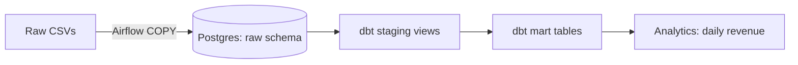

# 01 — Batch ETL with Airflow + dbt + Postgres

## What this project demonstrates
- **Orchestration:** Airflow DAG loads raw CSVs and triggers dbt transforms.
- **Warehouse modeling:** raw → staging (views) → mart (tables).
- **Testing:** dbt schema tests (unique/not_null/accepted_values).
- **Reproducibility:** Docker Compose environment.

## Architecture (Mermaid)


## Run locally
### 1) Start services
```bash
make up
```

### 2) Trigger the pipeline
- Open Airflow UI: http://localhost:8080  (user: `admin` / pass: `admin`)
- Run DAG **batch_etl_raw_to_mart**

### 3) Validate results
```bash
make psql
-- then in psql:
\dt mart.*;
select * from mart.mart_daily_revenue limit 10;
```

### 4) Run dbt tests manually (optional)
```bash
make dbt-run
make dbt-test
```

## What to screenshot for proof
- Airflow DAG run: all green tasks
- dbt test output: all passing
- Query result from `mart.mart_daily_revenue`

## Dataset
Synthetic e‑commerce dataset generated into:
- `data/raw/customers.csv`
- `data/raw/orders.csv`

## Key files
- Airflow DAG: `orchestration/airflow/dags/batch_etl_raw_to_mart.py`
- dbt models: `transform/dbt/models/`
