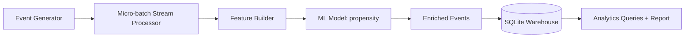

# Project 1 — Event Stream Enrichment + Propensity Scoring (AI Data Engineering)

## Business problem
An eCommerce team wants to **enrich clickstream events in near-real time** with a **purchase propensity score** to:
- personalize offers
- prioritize retargeting spend
- measure funnel conversion by segment

## What you’ll build (end-to-end)
- Generate realistic **session events** (page_view, add_to_cart, checkout, purchase)
- Build **features per session** (velocity, depth, cart actions, device, referrer)
- Train a **Logistic Regression propensity model** (baseline interpretable ML)
- Run a **micro-batch “stream”** to score sessions and write enriched events to a **SQLite warehouse**
- Produce analytics outputs (conversion by device/referrer, score deciles)

## Architecture


## Run it
```bash
cd project_1_event_enrichment
pip install -r requirements.txt

# 1) Generate raw events + labels
python -m src.generate_data --n_users 1500 --days 14

# 2) Train the model
python -m src.train_model

# 3) Enrich events via micro-batch streaming simulation
python -m src.enrich_stream --batch_size 5000

# 4) Load to SQLite + run analytics queries
python -m src.warehouse --db_path reports/warehouse.sqlite
python -m src.analytics --db_path reports/warehouse.sqlite
```

## Outputs
- `data/raw/events.csv` — generated clickstream events
- `data/processed/session_features.csv` — session-level features + label
- `models/propensity_model.joblib` — trained model
- `reports/warehouse.sqlite` — SQLite warehouse (events + sessions tables)
- `reports/analytics_summary.json` — KPIs and decile table

## Skills shown
- data modeling (events + sessions fact tables)
- feature engineering pipelines
- ML training + offline evaluation
- micro-batch streaming design
- warehouse loading + SQL analytics
