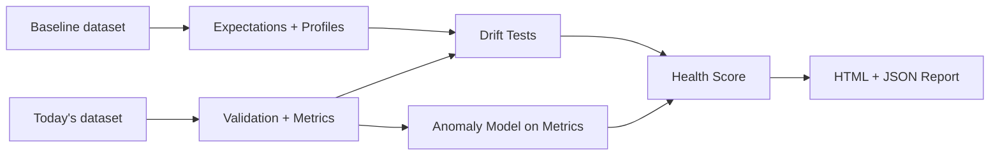

# Project 3 — Data Reliability Monitor (Drift + Anomaly Detection)

## Business problem
Data pipelines break in real life:
- schema changes
- null spikes
- distribution drift (e.g., price drops, traffic changes)
- metric anomalies (e.g., sudden conversion drop)

This project builds a **data reliability monitor** that runs like a daily job:
- validates schema + rules
- calculates health metrics
- detects drift (KS test) and anomalies (IsolationForest)
- outputs an **HTML report** and machine-readable JSON

## Architecture


## Run it
```bash
cd project_3_data_reliability_monitor
pip install -r requirements.txt

# 1) Generate baseline + daily datasets (includes realistic drift/anomalies)
python -m src.generate_data --days 30 --rows_per_day 2000

# 2) Run the monitor on the most recent day
python -m src.monitor --day_offset 0

# 3) Run the monitor on a prior day (simulate backfill checks)
python -m src.monitor --day_offset 7
```

## Outputs
- `reports/report_<date>.html` — human-readable report
- `reports/report_<date>.json` — machine-readable findings for alerting/CI
